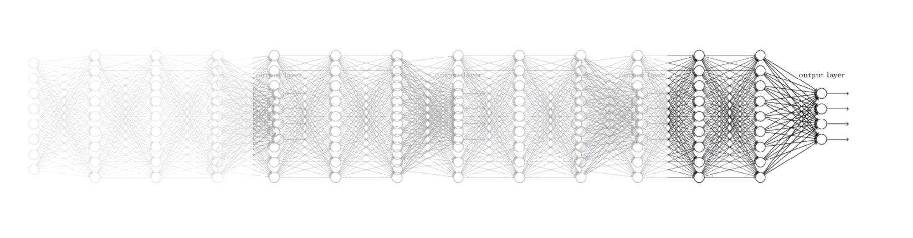

## Neural Network 1 (lec 9)

1. XOR 문제를 linear regression ( Logistic regression ) 만을 사용하여 단순하게 해결할 수 없음을 그래프를 그려 나타내보세요

 

2. XOR 문제를 Neural Network를 사용하여 (weight 까지 표기해서) 그려보세요

3. Neural Network 와 logistic regression 이 서로 다른 결정적인 요소가 무엇인가요 ?

   Sigmoid 함수를 활용하고, 여러개의 함수를 붙여서 사용했다는 점

4. Backpropagation 이 무엇인지 간략하게 설명해보세요 ( 필요하면 수식을 사용해도 좋습니다 )

   최종 output 에 각각의 function ( weight ) 이 미치는 영향을 미분하여 수학적으로 계산한 것

## Neural Network 2 (lec 10)

### Training Neural Network ( ReLU )

5. Neural Network 에서 layer 를 많이 쌓으면 쌓을수록 성능이 좋은가요? 그렇다면 ( 혹은 그렇지 않다면 ) 이유를 설명해보세요 (아래 그림이 힌트입니다)

   Gradient Vanishing, gradient 가 sigmoid 를 사용했기 때문에 각각의 neuron output 이 0과 1사이로 나오기 때문에 역전파 (back propagation) 를 하게 될 경우 앞쪽의 gradient 가 전부 0으로 수렴하게 되어 학습이 이뤄지지 않는다.

6. 5번 문제의 해결책이 무엇이었나요 ?

   Sigmoid 를 ReLU (혹은 다른 activation function) 로 교체한 것, gradient vanishing 이 해결되었다

   

7. (선택) Activation function 의 종류에 대해서 조사해보세요

   https://towardsdatascience.com/activation-functions-neural-networks-1cbd9f8d91d6

### Weight Initialization

8. Weight Initialization 의 방식을 나열해보세요

- RBM
- Xavier
- He

### Improving model performance

9. Dropout rate 을 0.7 로 설정한다는 것은 무슨 의미인가요 ?

   전체 network 의 70% 만 사용하여 학습한다는 뜻

10. (선택) Model Ensemble 에 대해서 조사해보세요

### Making Neural Networks

11. Fast forwarding 을 사용하여 ImageNet 에서 3% 대 error rate 을 보이는 딥러닝 네트워크 이름이 무엇인가요 ? ( Kaiming He 의 논문입니다)

    ResNet(https://arxiv.org/abs/1512.03385)

 

 