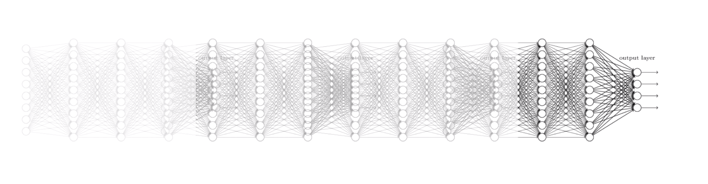

## Neural Network 1 (lec 9)

1. XOR 문제를 linear regression ( Logistic regression ) 만을 사용하여 단순하게 해결할 수 없음을 그래프를 그려 나타내보세요

 

2. XOR 문제를 Neural Network를 사용하여 (weight 까지 표기해서) 그려보세요

3. Neural Network 와 logistic regression 이 서로 다른 결정적인 요소가 무엇인가요 ?

4. Backpropagation 이 무엇인지 간략하게 설명해보세요 ( 필요하면 수식을 사용해도 좋습니다 )

## Neural Network 2 (lec 10)

### Training Neural Network ( ReLU )

5. Neural Network 에서 layer 를 많이 쌓으면 쌓을수록 성능이 좋은가요? 그렇다면 ( 혹은 그렇지 않다면 ) 이유를 설명해보세요 (아래 그림이 힌트입니다)

6. 5번 문제의 해결책이 무엇이었나요 ?

   

7. (선택) Activation function 의 종류에 대해서 조사해보세요

### Weight Initialization

8. Weight Initialization 의 방식을 나열해보세요

- 
- 
- 

### Improving model performance

9. Dropout rate 을 0.7 로 설정한다는 것은 무슨 의미인가요 ?

10. (선택) Model Ensemble 에 대해서 조사해보세요

### Making Neural Networks

11. Fast forwarding 을 사용하여 ImageNet 에서 3% 대 error rate 을 보이는 딥러닝 네트워크 이름이 무엇인가요 ? ( Kaiming He 의 논문입니다)

 

 